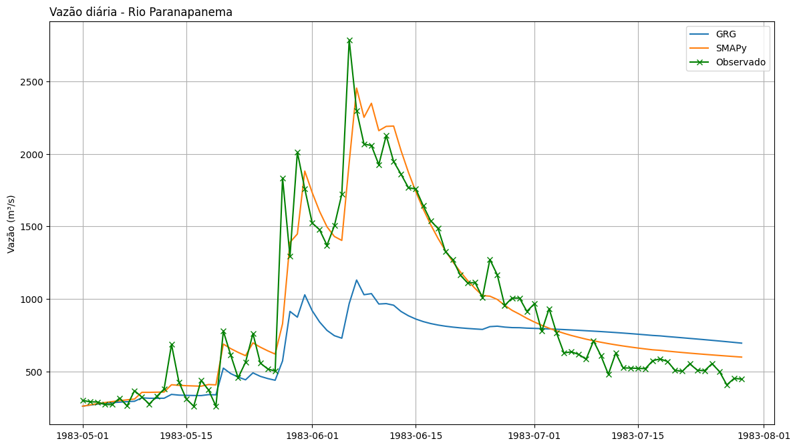

# SMAPy - Soil Moisture Accounting Procedure in Python
Este repositório contém um Jupyter Notebook com uma breve demonstração do pacote SMAPy. Um pacote para calibração do modelo SMAP e cálculo da vazão a partir da precipitação. 

O SMAPy é um produto desenvolvido por [Rodrigo Lins da Rocha Júnior](https://www.linkedin.com/in/rodrigo-j%C3%BAnior-520634195) para geração de previsão operacional de vazão para as principais bacias do Brasil.

Ficou interessado? Por favor, sinta-se a vontade para me contactar por [e-mail](mailto:rodrigo.lins.jr@gmail.com) 
